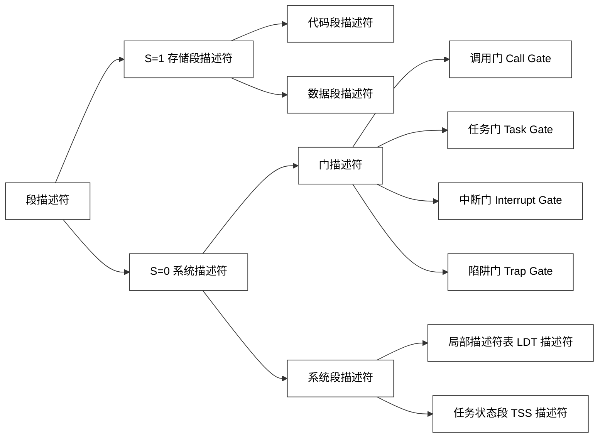

## 操作系统概述
### 操作系统的定义和特性
定义：操作系统是一个大型的程序系统，它负责计算机系统软件/硬件资源的分配；控制和协调并发活动；提供用户接口，使用户获得良好的工作环境
两个关键：
- *管理并调度资源*
- *为用户提供接口*

特性：
- **并发性**：同时处理多个任务的能力
- **共享性**：为多个并发任务提供资源共享
- **不确定性**：具有处理随机事件（中断）的能力

### 操作系统的功能
1. 进程管理
    - 处理机分配
    - 处理机管理
    - CPU 管理
2. 内存管理
    - 为应用程序运行非配和管理所需的内存
    - 支持多道程序设计
3. 设备管理
    - 设备的分配和回收
    - 设备的驱动机制/传输控制
    - 为应用提供统一接口访问设备
    - 高效存取设备/缓冲机制
4. 文件管理（*文件是设备的抽象*）
    - 文件用户接口
    - 存储空间管理
    - 文件的操作
    - 目录的操作
    - 存取权限管理

### 操作系统的性能/评价指标
- 吞吐率：在单位时间内处理信息的能力
- 资源利用率：CPU 使用的频度
- 响应能力：从接收数据到输出结果的时间间隔
- 可移植性：改变硬件环境仍能正常工作的能力
- 可靠性：发现、诊断和回复系统故障的能力

### 1.4 操作系统的发展历史
1. 手工操作（无操作系统）（40 年代 - 50 年代初）
2. 单道批处理系统（50 年代）
    - **联机批处理**：主机负责运算，同时控制输入/输出
    - **脱机批处理**：主机负责运算，卫星机控制输入/输出
3. 多道批处理系统（60 年代初）
    新技术：*中断 | 通道技术*
4. 分时操作系统（60 年代中 - 至今）
    三大特点：
    - **并发性**：多用户联机使用同一计算机
    - **独占性**：用户感觉独占计算机
    - **交互性**：及时响应用户的请求
    UNIX 是第一个使用化的分时操作系统

*思考题：多道批处理和分时系统都有多个作业同时存在，且 CPU 都会在作业间进行切换。这两种切换有什么区别？*
- 多道批处理系统：基于事件的被动切换
- 分时系统：基于时间片的主动切换

### 分时操作系统的衍化
- 实时操作系统 $\in$ 嵌入式操作系统
    - 硬实时系统：必须限时完成
    - 软实时系统：尽可能快完成
- 微机操作系统（PC 机操作系统）
- 多处理机操作系统
- 网络操作系统
- 分布式操作系统
- 嵌入式操作系统

### 操作系统的逻辑结构
逻辑结构的种类
1. 整体式结构（单体式结构，宏内核结构）：以**模块**为基本单位构建，每个模块具有特定的功能
2. 层次式结构：功能模块按**调用次序**排若干层，各层**单向**依赖或**单向**调用
    分层原则：
    - 最底层：硬件相关
    - 最顶层：用户策略/用户交互
    - 中间层：按调用次序/消息传递顺序
    - 较低层：共性的、活跃的服务
    优点：
    - 结构清晰，避免循环调用
    - 整体问题局部化，系统的正确性容易保证
    - *有利于操作系统的移植、维护、扩充*
3. 微内核结构（客户/服务器结构）：**微内核** + **核外服务器**
    微内核：足够小，提供 OK 最基本的核心功能和服务
    - 实现与硬件紧密相关的处理
    - 实现基本功能：基本 I/O，时钟，中断，进程
    - 负责客户和服务器间的通信
    核外服务器：
    - 完成 OS 绝大部分功能，等待客户提出请求
    - 由若干服务器或进程共同构成

## 操作系统硬件基础
### CPU 的态/可信计算
态的分类：
1. **核态**（Kernel mode）
    - 能够访问所有资源和执行所有指令
    - 管理程序/OS 内核
2. **用户态**（User mode，*目态*）
    - 仅能访问部分资源，其他资源受限
    - 用户程序
3. **管态**（Supervisor mode）
    - 介于核态和用户态之间

### 用户态和核态之间的转换
- 用户态向核态转换
    - 用户请求 OS 提供服务
    - 用户进程产生错误（内部中断）
    - 用户态企图执行特权指令
    - *发生中断*
- 核态向用户态转换的情形
    - *一般是中断返回：IRET*

### 特权指令
类别：
1. 涉及外部设备的输入/输出指令
2. 修改特殊寄存器的指令
3. 改变机器状态的指令

### 中断机制
中断定义：
- 指 CPU 对突发的外部事件的反应过程或机制
- CPU 收到*外部信号*（中断信号）后，停止当前工作，转去处理该*外部事件*，处理完毕后回到原来工作的*中断处*（断点）继续原来的工作

中断源：引起系统中断的事件

中断类型：
- **强迫中断**和**自愿中断**
    - 强迫中断：程序没有预期
    - 自愿中断：程序有预期（INT 21H）
- **外中断**和**内中断**
    - 外中断：由 CPU 外部事件引起（I/O）
    - 内中断：由 CPU 内部事件引起（INT 21H）
- 外中断：**不可屏蔽中断**和**可屏蔽中断**（看中断原因紧不紧要）

中断响应的实质：
- 交换指令执行地址
- 交换 CPU 的态

引入中断的目的：
- 实现并发活动
- 实现实时处理
- 故障自动处理

### 基本输入输出系统/BIOS
系统 BIOS
- 固件（firmware）
- 地址：F0000 - FFFFF

系统 BIOS 作用
1. 加电自检（POST）：起始地址 **FFFF0**
2. CMOS 设置：交互式设置系统参数
3. 基本 I/O 服务
4. 系统自举/加载 OS

### 操作系统的启动
![[Pasted image 20260114154743.png]]

**实模式**（实地址模式，REAL MODE）
- 按照 8086 方法访问 0 - FFFFFH 的地址空间（1MB）
- 寻址方式：*物理地址（20 位）= 段地址（16 位）：偏移地址（16 位）*
- CPU 单任务运行
实模式的空间：
- 前面 640K \[00000 - 9FFFF\]：基本内存
- 中间 128K \[A0000 - BFFFF\]：显卡内存
- 末尾 256K \[C0000 - FFFFF\]：BIOS

**保护模式**（内存保护模式，PROTECT MODE）
- 寻址方式：*段（16 位）和偏移量（32 位），寻址 4GB*
- CPU 支持多任务

## 用户节目与系统调用
### 用户界面
定义：操作系统提供给用户控制计算机的机制（用户接口）
类型：
- 操作界面
- 系统调用（SYSTEM CALL，系统功能调用）

| 类别         | 操作符   | 说明                       |
| ---------- | ----- | ------------------------ |
| 输入重定向      | `<`   | 将命令输入由默认的键盘更改/重定向为指定的文件  |
| 输出重定向      | `>`   | 将命令输出由默认的显示器更改/重定向为指定的文件 |
|            | `>>`  | 将命令输出重定向并追加到指定文件的末尾      |
| 错误重定向      | `2>`  | 将命令的错误输出重定向到指定文件（先清空）。   |
|            | `2>>` | 将命令的错误输出重定向到指定文件（追加到末尾）。 |
| 输出与错误组合重定向 | `&>`  | 将命令的正常输出和错误输出重定向到指定文件。   |

系统调用：操作系统**内核**为应用程序提供的**服务/函数**
- DOS: INT 21H + AH

| **编号 (AH)** | **功能描述** |
| ----------- | -------- |
| 01          | 键盘输入有回显  |
| 02          | 屏幕输出1个字符 |
| 03          | 显示输出     |
| 04          | 串口输入1字符  |
| ...         | ...      |
| 08          | 键盘输入无回显  |
| 09          | 显示字符串    |
| ...         | ...      |
| 39          | 建立子目录    |
| 3A          | 删除子目录    |
| 3B          | 改变当前目录   |
| 3C          | 创建文件     |
| ...         | ...      |
| 3F          | 读文件      |
| 40          | 写文件      |
| 4C          | 结束程序     |

- LINUX: INT 80H + EAX

|**系统调用号**|**功能描述**|
|---|---|
|01|结束进程|
|02|创建进程|
|03|读文件|
|04|写文件|
|05|打开文件|
|06|关闭文件|
|...|...|
|12|改变目录|
|14|创建节点|
|15|修改文件属性|
|39|创建目录|
|40|删除目录|
|42|创建管道|
|...|...|
|48|安装信号处理|
|52|解挂设备|

## 进程和进程管理
### 进程概念（Process）
定义：进程是程序在某个数据集和上的一次运行活动
特征：
- **动态性**：进程是程序的一次执行过程，动态产生/消亡
- **并发性**：进程可以同其他进程一起向前推进
- **异步性**：进程按各自速度向前推进
- **独立性**：进程是系统分配资源和调度 CPU 的单位

进程和程序的区别：
- 动态与静态
    - 进程是动态的：程序的一次执行过程
    - 程序是静态的：一组指令的有序集合
- 暂存与长存
    - 进程是暂存的：在内存驻留
    - 程序是长存的：在介质上长期保存
- 程序和进程的对应
    - 一个程序可能有多个进程

### 进程的状态
- 运行状态
- 就绪状态：具备运行条件但由于无 CPU，暂时不能运行
- 阻塞状态：因为等待某项**服务**完成或**信号**来到而不能运行的状态

变迁：
- 运行 <-> 就绪
- 运行  -> 阻塞
- 阻塞  -> 就绪

### 进程控制块（Process Control Block, PCB）
- 描述进程的状态、资源和相关进程的关系
- PCB 是进程的标志
- 创建进程时创建 PCB，进程撤销后 PCB 同时撤销

进程的描述：
进程 = 程序 + PCB 

### 任务状态段（Task State Segment）
Intel x86 架构中为了支持**多任务**和**上下文切换**而设置的数据结构
存储了任务执行的所有关键数据：
- 寄存器状态
- 特权级栈指针（核心作用）
- I/O 许可位图：决定该进程是否有权向执行 in/out 指令访问硬件端口

### 进程的上下文和进程切换
进程的上下文（Context）
- 进程运行环境
- 是 PCB 的一部分

分时系统的进程切换过程
- 进程的上下文在 CPU 中交换
- 换入进程的上下文进入 CPU（从栈/PCB 上来）
- 患处进程的上下文离开 CPU（到栈/PCB 上去）

### 进程控制
- 创建进程：Create (PID，StartAdd，CPUContext，Mem，Files)
- 进程撤销：
    - 撤销子进程（递归/可选）
    - 将子进程的父进程改为 init
- 进程阻塞
- 进程唤醒

进程控制原语：
- 原语：由若干指令构成的具有特定功能的函数，具有**原子性**，操作不可分割
- 创建原语、撤销原语、阻塞原语、唤醒原语

### Linux 进程控制
1. 创建进程：`pid_t pid = fork()`
    父进程和子进程：
    - 子进程：新建的进程
    - 父进程：`fork()` 的调用者
    - *子进程是父进程的复制*
    - *父进程和子进程并发运行*
    
    `fork()` 的返回值：pid
    - pid = 0（在子进程中）
    - pid > 0（在父进程中）（子进程 ID）
    - pid = -1 （出错）
2. 休眠进程：`sleep()`
3. 结束进程：`exit()`：子进程死了就变成**僵尸状态**，专门给父进程看的
4. 阻塞进程：`wait()`

*思考题：Linux 的其他进程都是 init 的子孙进程，那为什么每个进程的功能都不同*
子进程调用了 exec 函数族（包括若干系列函数）
- 调用成功：进入新进程且不再返回
- 调用失败：继续从调用点向下执行

### 线程
定义：
- 线程是进程内创建的可运行模块/指令序列，能执行特定的任务
- 进程内可以定义**多个**线程
- *线程和线程可以并发运行*

意义：
- 提高了系统的并发性能
- 应用成本更低、更灵活
    - 进程为线程提供资源和地址空间
    - 创建、撤销、管理以及线程间通信更容易、灵活

分类：
- 内核线程（Kernel Thread）
    - 创建、运行和撤销都在内核完成，由内核驱动
    - *没有独立的地址空间，只在内核空间运行，不切换到用户空间*
- 用户线程
    - 创建、运行和撤销无需内核干预
    - *运行在用户空间，共享所属进程的地址空间*

### 线程 vs 进程
进程：
- 程序代码：代码不一定专业，可共用
- 系统堆栈空间：专用
- 进程控制块：调度依据和记录资源
- *独立存储空间：专有且内含用户空间*

线程：
- *共享进程的存储空间*

### fork 和 vfork
fork: Copy-on-Write
- 子进程拥有自己**独立**的虚拟地址空间
vfork: Shared Address Space
- 子进程**不创建**新的页表，之间共享父进程的地址空间
- 父进程被挂起，子进程先行

### 临界资源和临界区
临界资源（Critial Resource）：一次只允许一个进程独占访问（使用）的资源
临界区（Critical Section）：进程中访问临界资源的程序段
~~临界这个翻译真是一坨💩~~

### 同步机制
P-V 操作
- P 操作：
    1. S <- S-1
    2. if S < 0，阻塞该进程
        if S >= 0，继续
    
- V 操作：
    1.  S <- S+1
    2. if S > 0，继续
        if S <= 0，从阻塞区唤醒一个

*我不理解课件上为什么会把这么简单的一个概念写的这么**杂乱无章毫无逻辑**。*
*说白了，S 表示最多可以同时使用这个资源的数量。*
*你执行 P 操作，就是先看现在的 S 是不是个正数，> 0 就表示现在有资源，然后你就直接拿着用，所以现在可以使用的数量就会减少一个 S <- S-1；这个数要是 <= 0，就表示现在没资源了，但是没资源你也还是要用，所以你就去阻塞区等着，然后为了告诉后面的人你在等着，你还是需要给资源减少一个 S <- S-1*
*执行 V 操作也差不多，你现在这个资源用完了，可用数量就先增加一个 S <- S+1，现在要是 S > 0，就表示没人等着，你该干嘛就干嘛；S <= 0，就表示现在还有人在阻塞区等着在，然后你再按顺序从阻塞区叫一个出来就行了*

## 死锁
### 定义和起因
定义：两个或多个进程无限期地等待永远不会发生的条件的一种系统状态
起因：
- 系统资源有限
- 并发的推进顺序不当

必要条件：多个进程构成环路，环中每个进程已占用的资源被前一进程申请，而自己所需的新资源又被后一进程占用

### 解决死锁
预防死锁：
- 破坏互斥条件
- 破坏不剥夺条件
- 破坏部分分配条件
- 破坏环路条件

预先静态分配法：进程仅当其所需全部资源可用时才开始运行
有序资源分配法：进程每次申请资源时只能申请序号更大的资源

## 进程调度与实现
### 调度定义与分类
定义：在队列中按某种策略选择最合适的对象
分类：
- 长程调度（宏观/作业调度）
    *作业：磁盘 -> 内存*
- 中程调度（交换调度）
    *进程：内存 -> 交换空间（虚拟内存）*
- 短程调度（进程调度）
    *进程：内存 -> CPU*
- I/O 调度（设备调度）
    *进程：设备 -> 就绪*

周转时间：
- 定义：$t=t_{complete}-t_{start}$
- 意义：说明进程在系统中停留时间的长短

带权周转事件：
- 定义：$w = \frac{t}{t_{run}}, w > 1$
- 意义：进程在系统中的**相对**停留时间

### 作业调度算法
- 先来先服务（First Come First Serve）
- 短作业优先（Short Job First）
- 响应比高者优先
  响应比 = 响应时间 / 运行时间（等于即时的带权周转时间 $w$）

### 进程调度算法
- 循环轮转调度法：~~排队枪毙~~
- 可变时间片轮转：~~有节奏的排队枪毙~~
- 多重时间片循环：~~多队伍并行排队枪毙~~
- 优先数调度（Linux 用的这个）
    - 静态优先数
    - 动态优先数

### Linux 进程调度
nice 命令可以降低优先级（root 用户还可以提高优先级）

## 内存管理与保护模式
### 存储管理的功能
1. 地址映射：
    - 固定地址映射：**编程或编译**时确定逻辑地址和物理地址的映射关系
    - 静态地址映射：程序**装入时**由操作系统完成映射（MA, BA, VA）
        占用**连续的**内存空间，装入后**不能移动**
    - 动态地址映射：程序**执行过程中**把逻辑地址转换为物理地址（MA, BA, VA，装入基址存在基址寄存器 BAR 里）
        - 可分配到**不连续的**多块内存中
        - 段式存储管理
2. 存储扩充（虚拟存储）
    - 页式虚拟存储
    - 段式虚拟存储
3. 内存分配
4. 存储保护
    - 界址寄存器：上限地址、下限地址寄存器，判断有无越界
    - 存储键保护：内存和进程里都存保护键，用的时候再比对

### 物理内存管理
- 单一分区管理（不分区）
- 分区存储管理
    - 固定分区
    - 动态分区
        放置策略：
        - 首次适应法：选择满足要求的地址最小空闲区
        - 最佳适应法：选择满足要求的最小空闲区——*最多碎片*
        - 最坏适应法：选择满足要求的最大空闲区
- 内存覆盖技术
- 内存交换技术：内存不够时写回磁盘，要运行时写回内存

### 虚拟内存管理
#### 页式内存管理（一维地址空间）
内存里的叫**页框（Frame）**，硬盘里的叫**页面（Page）**

虚拟地址 VA 分成页号 P 和页内偏移 W
- P = VA / 页大小（移位）
- W = WA % 页大小（位与）

页面映射表/页表：记录页面与页框之间的**对应关系**

操作系统为每个**进程**建立一个**页表**
- 基址放在 PCB（进程控制块）.TSS（任务状态段）.CR3（控制寄存器 3）

*缺页中断*
定义：当程序要访问的页面不在内存时，发生临时中断：缺页中断
处理：
- 立即将页面装入内存：从硬盘拷贝到内存

*常用淘汰算法*
- 最佳算法（OPT）
- 先进先出（FIFO）
- 最久未使用（LRU）
- 最不经常使用（LFU）

#### 段式内存管理（二维地址空间）
把进程按**逻辑意义**划分为多个段，每段由段名，长度不定

用段表来记录每段在内存中映射的位置（SMT, Segment Memory Table）
- 段号 S
- 段长 L
- 基地址 B

### 实模式和保护模式
#### 实模式
和前面将操作系统启动的位置一样，没什么新东西
- 按照 8086 方法访问 0 - FFFFFH 的地址空间（1MB）
- 寻址方式：*物理地址（20 位）= 段地址（16 位）：偏移地址（16 位）*

#### 保护模式
逻辑地址：*段相关信息（16 位）：偏移地址（32 位）*

### 段描述符（Descriptor）
描述段的属性，**8 字节**结构体
- 段基址：32 位
- 段限长：20 位
- 段属性：12 位

一些重要的属性
- DPL(Descriptor Privilege Level)：描述符权限等级
- P(Present)：是否在内存
- G：段的粒度
    - G=0，字节（段最长 1MB）
    - G=1，页面 4KB（段最长 4GB）
- S | TYPE：段的类型和特性
    - S=1（存储段）：代码段描述符/数据段描述符
    - S=0（系统段）：门描述符/系统段描述符

### 段描述符表：
存放**描述符**段数组/线性表
- 全局描述符表 GDT：全局唯一一个，每个进程可见
- 局部描述符表 LDT：每个进程/任务一个，*LDT 的描述符位于 GDT 中*
- 中断描述符表 IDT

### 选择子（Selector）
长度：16位
作用：用于选择 GDT 或 LDT 中段描述符
组成
- 索引域（INDEX）：13 位
- 表标识域：1 位（0 -> GDT, 1 -> LDT）
- 请求特权级域（RPL）：2 位

$$\text{段寄存器 (存选择子)} \xrightarrow{\text{查找}} \text{描述符表 (GDT/LDT)} \xrightarrow{\text{读取}} \text{段描述符} \xrightarrow{\text{提取基址}} \text{段内数据的物理地址}$$

### 权限级与变迁
权限级定义：
- DPL：描述符特权级
- RPL：请求特权级（16 位）
- CRL：当前特权级（16 位）

### 门描述符
在保护模式下，门描述符（Gate Descriptor）是通往不同特权级代码段的受控入口。
定义：描述目标代码入口（Target Code Entry）的相关信息。
作用：作为“守卫”，防止低特权级代码随意跳转到高特权级区域。

根据段描述符中的 **S位 (System)**，描述符分为两大类：

S=0 系统描述符：
- 系统段描述符：
    - LDT 描述符 (Local Descriptor Table)
    - TSS 描述符 (Task State Segment)
- 门描述符
    - 调用门 (Call Gate)：用于不同特权级之间的子程序调用（如系统调用）。
    - 任务门 (Task Gate)：用于任务切换。
    - 中断门 (Interrupt Gate)：处理硬件中断（自动关中断 IF=0）。
    - 陷阱门 (Trap Gate)：处理异常（不自动关中断）。

操作系统引入门描述符主要为了实现以下三种控制流变换：
- 任务内跨特权级跳转：允许低特权级（如 Ring 3）代码受控地访问高特权级（如 Ring 0）服务。
- 任务间的切换：通过任务门或 TSS 进行上下文切换。
- 中断响应与服务：从中断响应 $\rightarrow$ 跳转至中断服务程序（ISR）。

## 设备管理系统
### 缓冲技术
作用：
- 连接不同数据传输速度的设备
- 协调数据记录大小的不一致
- 正确执行应用程序的语义拷贝

### 阻塞攻击模式和非阻塞攻击模式
阻塞攻击模式：若不能提供服务，则挂起应用进程直到条件满足
- 用进程进入休眠状态（不占用CPU）
- 转移到设备的等待队列

非阻塞攻击模式若不能提供服务，返回应用进程错误代码，不挂起
- 措施1：做错误处理（如结束正常工作）
- 措施2：重新申请服务

## 文件系统与实现
### 文件
文件概念
- 文件是计算机系统存放信息的一种形式，由若干信息项有序构成
- 文件具有唯一的文件名
- 用户通过读写指针来存取文件段信息项

文件段逻辑结构
- 记录式文件
    - 文件头部保存记录长和记录数信息
    - 浪费存储空间
- 流式文件：信息项是**字节**
    - 文件长度=字节的数量
    - 无需额外说明/控制信息

文件的存取方法
- 顺序存取
- 随机存取（直接访问）~~很难想象是什么人第一个翻译成随机的~~

文件段物理结构
- 连续文件
- 串联文件——*FAT文件系统*
- 索引文件（Linux ext2 32 字节）
    - 文件存放在不连续的存储块中，系统建立索引表记录文件逻辑块和存储块的对应关系
    - 索引文件 = 索引表 + 数据区

### FAT16 文件系统
- FAT 元素 16 位宽，存储块数 <= $2^{16}$ 块
- 存储块 = 64 个扇区（这个是自己调的，扇区默认 512 字节）
- 磁盘容量 <= $2^{16}\times 64 \times 512$ 字节 = 2GB

### 链接形式
硬链接
- 硬链接是一个文件的入口路径，删掉原文件**仍能**访问
软链接
- 软链接是指创建一个LINK类型的新文件，在新文件中只包含被共享文件的路径名以链接原文件，删掉原文件**不能**访问